<h3><code>bangarukondabollapally@github ~ $ ./contributions.sh</code></h3>

  

<h3><code>bangarukondabollapally@github ~ $ whoami</code></h3>

<table>
<tr>
<td valign="top">

</td>
<td valign="top">

</td>
</tr>
</table>

  

<h3><code>bangarukondabollapally@github ~ $ ./links.sh</code></h3>

<b>Frontend Developer · Building responsive and interactive web experiences</b>

